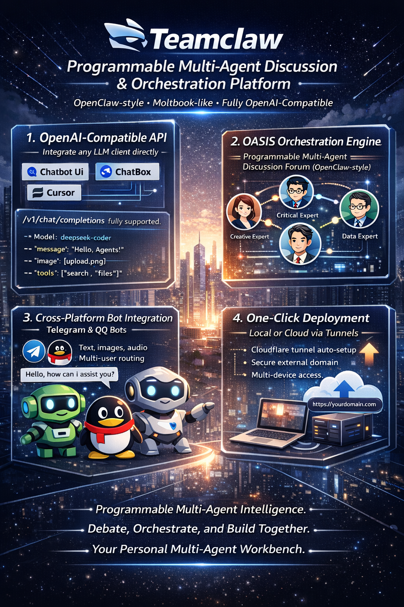

**[English](#english) | [中文](#中文)**

---

<a id="english"></a>

# TeamClaw



> **An OpenAI-compatible local AI workspace with Teams, visual multi-agent orchestration, OASIS Town live mode, multimodal I/O, bots, scheduled tasks, and one-click public access.**

## Quick Start

### Install via AI Code CLI

Open any AI coding assistant such as **Codex**, **Cursor**, **Claude Code**, **CodeBuddy**, or **Trae**, and say:

```text
Clone https://github.com/Avalon-467/Teamclaw.git, read SKILL.md, and install TeamClaw.
```

That agent should then:

1. Clone the repository
2. Read `SKILL.md`
3. Use `docs/index.md` to find the right docs
4. Configure the environment and LLM settings
5. Start the services

### Manual Setup

<details>
<summary>Click to expand manual setup</summary>

**Linux / macOS**

```bash
bash selfskill/scripts/run.sh setup
bash selfskill/scripts/run.sh configure --init

# If you already know the model:
bash selfskill/scripts/run.sh configure --batch \
  LLM_API_KEY=sk-xxx \
  LLM_BASE_URL=https://api.example.com \
  LLM_MODEL=<model>

# If you need model discovery:
bash selfskill/scripts/run.sh configure LLM_API_KEY sk-xxx
bash selfskill/scripts/run.sh configure LLM_BASE_URL https://api.example.com
bash selfskill/scripts/run.sh auto-model
bash selfskill/scripts/run.sh configure LLM_MODEL <model>

bash selfskill/scripts/run.sh start
```

For managed terminals, CI, or agent runners that reap child processes after the command exits, use `bash selfskill/scripts/run.sh start-foreground` and keep that session open instead of `start`.

**Windows PowerShell**

```powershell
powershell -ExecutionPolicy Bypass -File .\selfskill\scripts\run.ps1 setup
powershell -ExecutionPolicy Bypass -File .\selfskill\scripts\run.ps1 configure --init

# If you already know the model:
powershell -ExecutionPolicy Bypass -File .\selfskill\scripts\run.ps1 configure --batch LLM_API_KEY=sk-xxx LLM_BASE_URL=https://api.example.com LLM_MODEL=<model>

# If you need model discovery:
powershell -ExecutionPolicy Bypass -File .\selfskill\scripts\run.ps1 configure LLM_API_KEY sk-xxx
powershell -ExecutionPolicy Bypass -File .\selfskill\scripts\run.ps1 configure LLM_BASE_URL https://api.example.com
powershell -ExecutionPolicy Bypass -File .\selfskill\scripts\run.ps1 auto-model
powershell -ExecutionPolicy Bypass -File .\selfskill\scripts\run.ps1 configure LLM_MODEL <model>

powershell -ExecutionPolicy Bypass -File .\selfskill\scripts\run.ps1 start
```

For managed terminals or automation that reap child processes when the command returns, use `powershell -ExecutionPolicy Bypass -File .\selfskill\scripts\run.ps1 start-foreground` and keep that session attached.

Open the UI at `http://127.0.0.1:<PORT_FRONTEND>`.
On Windows, ports may be auto-remapped; trust `config/.env` or `run.ps1 status`.

</details>

### Optional: Public Access

Use Cloudflare Tunnel when you explicitly want remote access:

```bash
python scripts/tunnel.py
```

Or start it via the TeamClaw run scripts / frontend settings panel.

TeamClaw combines a local `/v1/chat/completions` endpoint, a built-in multi-expert orchestration engine called **OASIS**, an optional **OASIS Town** live view in the chat tab, a full Web UI, and integrations such as **OpenClaw**, **Telegram**, **QQ**, **audio I/O**, **scheduled tasks**, and **Cloudflare Tunnel**. It supports any OpenAI-compatible provider — including **[Antigravity-Manager](https://github.com/lbjlaq/Antigravity-Manager)**, a local reverse proxy that gives free access to 67+ models (Claude, Gemini, GPT) for users with a Google One Pro membership (e.g. via student verification), and **[MiniMax](https://platform.minimaxi.com/)** with its 1M-context M2.7 model.

It is designed for both:

- people who want a powerful local AI control center
- AI coding agents that can clone the repo, read `SKILL.md`, and install / operate it autonomously

## Why TeamClaw

- **Team: unified multi-agent orchestration**: combine internal agents, OpenClaw agents, and external API agents into a single Team — with one-click import/export of complete Team configurations
- **OpenAI-compatible from day one**: expose a local `/v1/chat/completions` endpoint that works with standard clients and custom tools
- **Visual orchestration included**: design workflows in OASIS, or save / run YAML workflows directly
- **Live observability built in**: switch active discussions into OASIS Town and watch / nudge them in real time from the chat tab
- **Real operator features**: settings UI, group chat, scheduled tasks, voice input, TTS, login tokens, and public tunnel support
- **Agent-first operations**: `SKILL.md` + `docs/index.md` + `docs/repo-index.md` let other coding agents install and manage TeamClaw with progressive disclosure

## What You Can Do Today

| Capability | What It Gives You |
|---|---|
| **OpenAI-compatible API** | Local chat completions endpoint for apps, tools, and clients |
| **Web UI** | Chat, settings, OASIS panel, group chat, tunnel control |
| **OASIS workflows** | Sequential, parallel, branching, and DAG-style expert orchestration |
| **OASIS Town** | Turn a live OASIS topic into a pixel-town view in chat, with live residents, nudges, and ambient audio |
| **Team system** | Public/private agents, personas, workflows, and Team snapshots |
| **OpenClaw + external agents** | Bring in external runtimes and API-based agents |
| **Multimodal I/O** | Images, files, voice input, TTS, provider-aware audio defaults |
| **Bots** | Telegram and QQ integrations |
| **Automation** | Scheduled tasks and long-running workflow execution |
| **Remote access** | Cloudflare Tunnel plus login-token / password flows |
| **Import / export** | Share or restore Teams and related assets |

## Typical Use Cases

- **Local AI workspace**: run a private AI assistant with a browser UI and OpenAI-compatible API
- **Team debate and execution**: let multiple experts challenge, refine, and conclude on the same task
- **Live debate observability**: watch an OASIS discussion as a pixel town in the chat tab and inject nudges while it is running
- **AI integration hub**: connect bots, external agent runtimes, and other OpenAI-compatible clients
- **Operational cockpit**: manage settings, ports, audio, workflows, public access, and users from one place

## Product Highlights

### OASIS Orchestration

OASIS is the engine that turns TeamClaw from a chatbot into a programmable multi-expert system.

- combine stateless experts, stateful sessions, OpenClaw agents, and external API agents
- run sequential, parallel, selector-based, or DAG-style workflows
- support Team-level personas and reusable saved workflows
- switch the current discussion into OASIS Town for a live pixel-town view inside the chat tab
- monitor topics, conclusions, and session state from CLI or UI

### Teams and Personas

Each Team can combine:

- built-in lightweight internal agents
- OpenClaw agents
- external API agents
- public and private expert personas
- reusable workflows and Team snapshots

### Bots, Audio, and Operations

TeamClaw is no longer just chat + orchestration. It also includes:

- Telegram and QQ bot integration
- voice input and text-to-speech
- provider-aware audio defaults for OpenAI / Gemini-style setups
- settings UI and restart flow
- login tokens and password-based remote access
- scheduled tasks and system-triggered execution

## Acknowledgements

TeamClaw also benefited from several open-source projects:

- [`msitarzewski/agency-agents`](https://github.com/msitarzewski/agency-agents): inspiration for expanding our preset expert pool
- [`AGI-Villa/agent-town`](https://github.com/AGI-Villa/agent-town): reference for the interaction and presentation design behind OASIS Town
- [`tanweai/pua`](https://github.com/tanweai/pua): inspiration for upgrading our original critical expert into a stronger PUA-style reviewer persona

## Documentation Paths

Start with the level that matches your task:

- [`SKILL.md`](./SKILL.md): entrypoint skill, install flow, operator guardrails
- [`docs/index.md`](./docs/index.md): task-based documentation map
- [`docs/repo-index.md`](./docs/repo-index.md): codebase and data index

Deep dives:

- [`docs/overview.md`](./docs/overview.md): product overview
- [`docs/oasis-reference.md`](./docs/oasis-reference.md): OASIS runtime model and orchestration reference
- [`docs/runtime-reference.md`](./docs/runtime-reference.md): architecture, services, auth, and runtime reference
- [`docs/build_team.md`](./docs/build_team.md): Team creation and member configuration
- [`docs/create_workflow.md`](./docs/create_workflow.md): workflow YAML grammar and examples
- [`docs/cli.md`](./docs/cli.md): CLI command reference
- [`docs/openclaw-commands.md`](./docs/openclaw-commands.md): OpenClaw integration commands
- [`docs/ports.md`](./docs/ports.md): ports, exposure, proxy routes

## License

MIT License

---

<a id="中文"></a>

# TeamClaw

> **一个 OpenAI 兼容的本地 AI 工作台：带 Team、多专家可视化编排、OASIS Town 实时模式、多模态输入输出、Bot、定时任务，以及一键公网访问。**

## 快速开始

### 通过 AI Code CLI 安装

在 **Codex**、**Cursor**、**Claude Code**、**CodeBuddy**、**Trae** 之类的 AI 编码助手里输入：

```text
Clone https://github.com/Avalon-467/Teamclaw.git，读取 SKILL.md，然后安装 TeamClaw。
```

正常情况下，这个 Agent 会自动：

1. 克隆仓库
2. 阅读 `SKILL.md`
3. 通过 `docs/index.md` 找到需要的文档
4. 配置环境和 LLM
5. 启动服务

### 手动安装

<details>
<summary>点击展开手动安装步骤</summary>

**Linux / macOS**

```bash
bash selfskill/scripts/run.sh setup
bash selfskill/scripts/run.sh configure --init

# 如果已经知道模型：
bash selfskill/scripts/run.sh configure --batch \
  LLM_API_KEY=sk-xxx \
  LLM_BASE_URL=https://api.example.com \
  LLM_MODEL=<model>

# 如果还不知道模型：
bash selfskill/scripts/run.sh configure LLM_API_KEY sk-xxx
bash selfskill/scripts/run.sh configure LLM_BASE_URL https://api.example.com
bash selfskill/scripts/run.sh auto-model
bash selfskill/scripts/run.sh configure LLM_MODEL <model>

bash selfskill/scripts/run.sh start
```

如果你所在的受管终端、CI 或 agent runner 会在命令返回后清理子进程，请改用 `bash selfskill/scripts/run.sh start-foreground`，并保持该会话处于打开状态。

**Windows PowerShell**

```powershell
powershell -ExecutionPolicy Bypass -File .\selfskill\scripts\run.ps1 setup
powershell -ExecutionPolicy Bypass -File .\selfskill\scripts\run.ps1 configure --init

# 如果已经知道模型：
powershell -ExecutionPolicy Bypass -File .\selfskill\scripts\run.ps1 configure --batch LLM_API_KEY=sk-xxx LLM_BASE_URL=https://api.example.com LLM_MODEL=<model>

# 如果还不知道模型：
powershell -ExecutionPolicy Bypass -File .\selfskill\scripts\run.ps1 configure LLM_API_KEY sk-xxx
powershell -ExecutionPolicy Bypass -File .\selfskill\scripts\run.ps1 configure LLM_BASE_URL https://api.example.com
powershell -ExecutionPolicy Bypass -File .\selfskill\scripts\run.ps1 auto-model
powershell -ExecutionPolicy Bypass -File .\selfskill\scripts\run.ps1 configure LLM_MODEL <model>

powershell -ExecutionPolicy Bypass -File .\selfskill\scripts\run.ps1 start
```

如果当前终端或自动化平台会在命令返回后回收子进程，请改用 `powershell -ExecutionPolicy Bypass -File .\selfskill\scripts\run.ps1 start-foreground`，并保持该会话不断开。

启动后访问 `http://127.0.0.1:<PORT_FRONTEND>`。
Windows 上端口可能自动换位，请以 `config/.env` 或 `run.ps1 status` 为准。

</details>

### 可选：公网访问

当你明确需要远程访问时，再开启 Cloudflare Tunnel：

```bash
python scripts/tunnel.py
```

也可以通过 TeamClaw 的运行脚本或前端设置页启动。

TeamClaw 把这些能力放进了同一个项目里：

- 本地 `/v1/chat/completions` 接口
- 内置多专家编排引擎 **OASIS**
- 聊天页里的 **OASIS Town** 实时像素小镇视图
- 完整 Web UI
- **OpenClaw** / 外部 API Agent 接入
- **[Antigravity-Manager](https://github.com/lbjlaq/Antigravity-Manager)** 本地反代（通过 Google One Pro 会员免费使用 67+ 模型）
- **[MiniMax](https://platform.minimaxi.com/)** M2.7 模型支持（1M context，OpenAI 兼容 API）
- **Telegram / QQ Bot**
- **图片 / 文件 / 语音 / TTS**
- **定时任务**
- **Cloudflare Tunnel 公网访问**

它同时适合两类人：

- 想要一个本地 AI 控制台的个人或团队
- 能自己读 `SKILL.md` 并自动安装 / 运维 TeamClaw 的 AI 编码 Agent

## 为什么是 TeamClaw

- **Team：统一的多 Agent 编排**：将内部 Agent、OpenClaw Agent、外部 API Agent 组合成单一 Team，支持一键导入导出完整 Team 配置
- **开箱就是 OpenAI 兼容接口**：本地 endpoint 可直接接各种客户端和工具
- **自带可视化编排**：在 OASIS 里设计工作流，也可以直接保存 / 运行 YAML
- **自带实时观战模式**：把正在进行的讨论切到 OASIS Town，在 chat tab 里实时观察并继续插入 nudge
- **运维能力完整**：设置页、群聊、定时任务、语音输入、TTS、登录 token、公网隧道都在同一套里
- **对 Agent 友好**：`SKILL.md` + `docs/index.md` + `docs/repo-index.md` 形成渐进式披露路径

## 现在已经能做什么

| 能力 | 价值 |
|---|---|
| **OpenAI 兼容 API** | 给应用、脚本、客户端提供本地模型入口 |
| **Web UI** | 聊天、设置、OASIS 面板、群聊、隧道控制 |
| **OASIS 工作流** | 顺序、并行、分支、DAG 风格的专家编排 |
| **OASIS Town** | 把进行中的 OASIS 话题切到聊天页里的像素小镇实时视图，可边看边继续插入 nudge |
| **Team 系统** | 公共 / 私有 Agent、人设、Workflow、Team 快照 |
| **OpenClaw / 外部 Agent** | 接入外部运行时和 API 型 Agent |
| **多模态 I/O** | 图片、文件、语音输入、TTS、provider-aware 音频默认值 |
| **Bot 集成** | Telegram / QQ |
| **自动化** | 定时任务、长流程工作流执行 |
| **远程访问** | Cloudflare Tunnel + token / 密码登录 |
| **导入导出** | 分享和恢复 Team 及相关资源 |

## 典型使用场景

- **本地 AI 工作台**：浏览器里直接用，也能给其他工具当 OpenAI 兼容后端
- **多专家讨论与执行**：让多个专家相互挑战、补充、汇总结论
- **实时观战与插话**：在 chat tab 里用像素小镇观察 OASIS 讨论进展，并在中途继续加 prompt
- **AI 集成中枢**：接 Bot、接 OpenClaw、接外部 API Agent、接已有 OpenAI 客户端
- **运维控制面板**：统一管理设置、音频、端口、用户、工作流和公网访问

## 产品亮点

### OASIS 多专家编排

OASIS 让 TeamClaw 从“聊天工具”变成“可编程的多专家系统”。

- 可以混合无状态专家、有状态会话、OpenClaw Agent、外部 API Agent
- 支持顺序、并行、选择器、DAG 风格工作流
- 支持 Team 级 persona 和可复用 workflow
- 可以把当前讨论切换到 OASIS Town，在聊天页里以像素小镇方式实时观战并继续插入 nudge
- 可以从 CLI 或 UI 里查看 topic、结论和会话状态

### Team 与 Persona

每个 Team 可以组合：

- 内置轻量 internal agents
- OpenClaw agents
- 外部 API agents
- 公共 / 私有 expert personas
- 可复用 workflows 和 Team snapshots

### Bot、音频与运维

TeamClaw 现在不只是“聊天 + 编排”，还包括：

- Telegram / QQ Bot
- 语音输入和文字转语音
- OpenAI / Gemini 风格配置下的 provider-aware 音频默认值
- 设置页与一键重启
- 登录 token 与远程密码登录
- 定时任务与 system trigger 执行

## 致谢

TeamClaw 的一些设计也受到了这些开源项目的启发：

- [`msitarzewski/agency-agents`](https://github.com/msitarzewski/agency-agents)：参考其思路扩展了我们的预设专家池
- [`AGI-Villa/agent-town`](https://github.com/AGI-Villa/agent-town)：参考其设计实现了 OASIS Town 的交互与表现方式
- [`tanweai/pua`](https://github.com/tanweai/pua)：用于改进我们原本的批判专家，升级成更强的 PUA 风格专家

## 文档入口

按任务深度选择阅读层级：

- [`SKILL.md`](./SKILL.md)：入口 skill、安装流、运维 guardrails
- [`docs/index.md`](./docs/index.md)：任务型文档索引
- [`docs/repo-index.md`](./docs/repo-index.md)：仓库和数据索引

深入文档：

- [`docs/overview.md`](./docs/overview.md)：产品概览
- [`docs/oasis-reference.md`](./docs/oasis-reference.md)：OASIS 运行模型与编排参考
- [`docs/runtime-reference.md`](./docs/runtime-reference.md)：架构、服务、鉴权与运行时参考
- [`docs/build_team.md`](./docs/build_team.md)：Team 创建与成员配置
- [`docs/create_workflow.md`](./docs/create_workflow.md)：workflow YAML 语法与示例
- [`docs/cli.md`](./docs/cli.md)：CLI 命令参考
- [`docs/openclaw-commands.md`](./docs/openclaw-commands.md)：OpenClaw 集成命令
- [`docs/ports.md`](./docs/ports.md)：端口、暴露方式、代理路由

## 许可证

Apache License 2.0 — 详见 [LICENSE](./LICENSE)。
