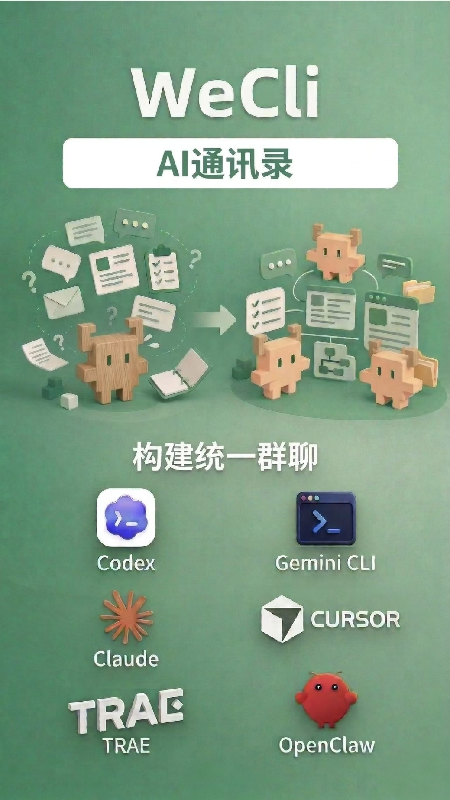
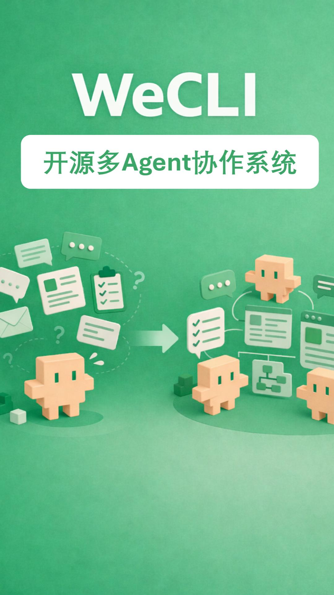

# Wecli

**[中文版 README](./README_CN.md)**



> **An OpenAI-compatible local AI workspace with Teams, visual multi-agent orchestration, OASIS Town, living GraphRAG memory, multimodal I/O, bots, scheduled tasks, and one-click public access.**

## Product Video

<p align="center">
  <a href="https://youtube.com/shorts/OKuZNwz-CP0">
    
  </a>
</p>

<p align="center">
  <a href="https://youtube.com/shorts/OKuZNwz-CP0">Watch the Wecli demo video on YouTube</a>
</p>

## Quick Start

### Install via AI Code CLI

Open any AI coding assistant such as **Codex**, **Cursor**, **Claude Code**, **CodeBuddy**, or **Trae**, and say:

```text
Clone https://github.com/WeCli/WeCli.git, read AGENTS.md, and install Wecli.
```

### Manual Setup

<details>
<summary>Click to expand manual setup</summary>

**Linux / macOS**

```bash
bash selfskill/scripts/run.sh start
# start 会按需执行与 setup 相同的环境脚本（venv、依赖、acpx 等），并初始化 .env、启动服务
# → Open http://127.0.0.1:51209
# → First login: passwordless on localhost (或使用终端打印的 Magic link)
# → Setup wizard auto-appears if LLM not configured
```

**Windows PowerShell**

```powershell
powershell -ExecutionPolicy Bypass -File .\selfskill\scripts\run.ps1 start
```

Open the UI at `http://127.0.0.1:<PORT_FRONTEND>`.

</details>

For the full install guide (OpenClaw, Antigravity, MiniMax, WSL, manual CLI config, troubleshooting), see [`SKILL.md`](./SKILL.md).

## Why Wecli

- **Team: unified multi-agent orchestration** — combine internal agents, OpenClaw agents, and external API agents into a single Team with one-click import/export
- **ACP-powered external agent communication** — use `acpx` to broadcast messages to OpenClaw, Codex, Claude, Gemini, and Aider through the Agent Client Protocol
- **AI team builder built in** — use WeCli Creator to discover SOP pages, extract roles with TinyFish, and generate editable personas plus a DAG workflow
- **OpenAI-compatible from day one** — expose a local `/v1/chat/completions` endpoint that works with standard clients and custom tools
- **Claude-Code-style delegation inside WeBot** — role-based subagents, persisted run/task state, plan/todo/verification primitives, approval-aware tool policy hooks
- **Visual orchestration included** — design workflows in OASIS, or save / run YAML workflows directly
- **Live observability built in** — open the OASIS Town sidebar in WeCli Studio, watch the pixel town, inspect the swarm graph, and nudge the discussion in real time
- **GraphRAG included** — seed each topic with a swarm blueprint, keep a living graph, and optionally mirror retrieval to Zep
- **Real operator features** — settings UI, group chat, scheduled tasks, voice input, TTS, login tokens, and public tunnel support
- **Agent-first operations** — `AGENTS.md` + `SKILL.md` + `docs/index.md` let AI coding agents install and manage Wecli with progressive disclosure

## What You Can Do Today

| Capability | What It Gives You |
|---|---|
| **OpenAI-compatible API** | Local chat completions endpoint for apps, tools, and clients |
| **Web UI** | Chat, settings, OASIS panel, group chat, tunnel control |
| **WeCli Creator** | Turn a task description or discovered SOP pages into roles, personas, and an OASIS DAG |
| **OASIS workflows** | Sequential, parallel, branching, and DAG-style expert orchestration |
| **OASIS Town** | WeCli Studio sidebar with pixel-town mode, live residents, nudges, and swarm graph |
| **GraphRAG memory** | Persist each topic as a living graph in local SQLite, with optional Zep mirroring |
| **ReportAgent** | Ask why the current prediction leans a certain way and get graph-backed evidence |
| **Team system** | Public/private agents, personas, workflows, and Team snapshots |
| **OpenClaw + external agents** | Bring in external runtimes and API-based agents |
| **Multimodal I/O** | Images, files, voice input, TTS, provider-aware audio defaults |
| **Bots** | Telegram and QQ integrations |
| **Automation** | Scheduled tasks and long-running workflow execution |
| **TinyFish monitor** | Crawl competitor pricing pages, store snapshots, detect price changes |
| **Flow distribution** | Use [WecliHub](https://wecli.net) to browse, distribute, and share flows |
| **Remote access** | Cloudflare Tunnel plus login-token / password flows |
| **Import / export** | Share or restore Teams and related assets |

## Flow Distribution Platform

**[WecliHub](https://wecli.net)** is the companion flow distribution platform:

- Browse published Wecli flows
- Distribute reusable workflows to other users
- Share flow links as a lightweight workflow catalog entry

## Typical Use Cases

- **Local AI workspace** — run a private AI assistant with a browser UI and OpenAI-compatible API
- **Team debate and execution** — let multiple experts challenge, refine, and conclude on the same task
- **Live debate observability** — watch an OASIS discussion from the Town sidebar, inspect the swarm graph, and inject nudges
- **Prediction / GraphRAG cockpit** — use OASIS topics as living world models with evidence-backed report answers
- **AI integration hub** — connect bots, external agent runtimes, and other OpenAI-compatible clients
- **Competitor monitoring** — schedule daily pricing crawls, compare stored snapshots, and detect changes
- **Operational cockpit** — manage settings, ports, audio, workflows, public access, and users from one place

## Product Highlights

### OASIS Orchestration

OASIS turns Wecli from a chatbot into a programmable multi-expert system:

- Mix stateless experts, stateful sessions, OpenClaw agents, and external API agents
- Run sequential, parallel, selector-based, or DAG-style workflows
- Seed a Town Genesis scaffold, then upgrade it into a richer swarm graph
- Persist topic memory as a living graph and optionally mirror retrieval into Zep
- Open the current discussion in WeCli Studio's OASIS Town sidebar for live pixel-town view and report queries

### Teams and Personas

Each Team can combine built-in internal agents, OpenClaw agents, external API agents, public/private expert personas, and reusable workflows. WeCli Creator can draft a Team from a task description, discovered SOP pages, or a workflow canvas.

### Bots, Audio, and Operations

- Telegram and QQ bot integration
- Voice input and text-to-speech with provider-aware defaults
- TinyFish competitor-site monitoring with scheduled runs and price-change history
- Settings UI, login tokens, password-based remote access, and scheduled tasks

## Acknowledgements

Wecli benefited from several open-source projects:

- [`msitarzewski/agency-agents`](https://github.com/msitarzewski/agency-agents) — inspiration for expanding the preset expert pool
- [`AGI-Villa/agent-town`](https://github.com/AGI-Villa/agent-town) — reference for OASIS Town's interaction and presentation design
- [`tanweai/pua`](https://github.com/tanweai/pua) — inspiration for upgrading the critical expert into a stronger PUA-style reviewer

## Documentation

| File | Audience | Purpose |
|---|---|---|
| [`AGENTS.md`](./AGENTS.md) | AI Agents | Behavior rules, task router, progressive disclosure |
| [`SKILL.md`](./SKILL.md) | Agents + Humans | Complete install, config, debug, and troubleshooting guide |
| [`docs/index.md`](./docs/index.md) | Both | Task-based documentation map to all deep-dive docs |

## License

Apache License 2.0 — see [LICENSE](./LICENSE).
