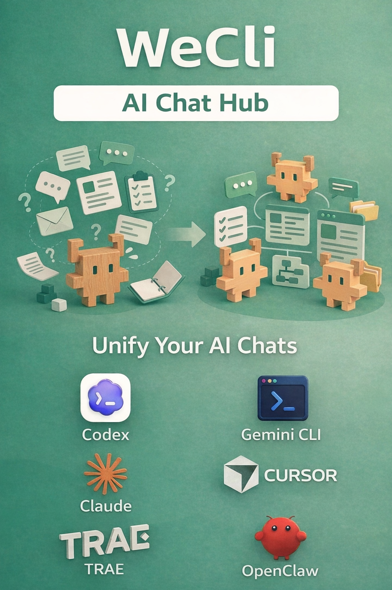
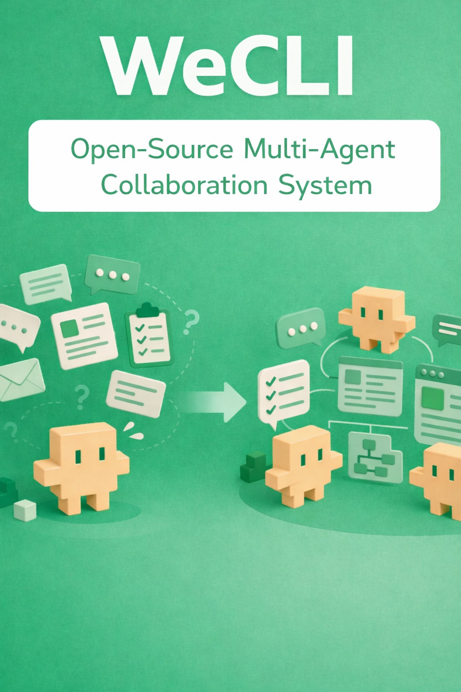

# Wecli

**[中文版 README](./README_CN.md)**

<p align="center">
  
</p>

> **A local AI workspace where multiple expert agents collaborate, debate, and execute — with a visual workflow engine, living memory, and one-click public access.**

## What is Wecli?

Wecli turns a single chatbot into a **programmable multi-expert system**. You create a **Team** — a group of AI agents with distinct roles and personas — and let them collaborate on tasks through visual workflows. Each discussion builds a **living knowledge graph** that persists across sessions.

**Key concepts at a glance:**

| Term | Meaning |
|------|---------|
| **Team** | A group of internal agents, external agents, and personas that work together |
| **OASIS** | The visual workflow engine that orchestrates multi-expert discussions (sequential, parallel, branching, DAG) |
| **OASIS Town** | A pixel-town visualization in the Studio sidebar where you watch live discussions and inspect the swarm graph |
| **WeBot** | A Claude-Code-style delegated runtime with role-based subagents, plan/todo/verification, and approval-aware tool policies |
| **GraphRAG** | A living knowledge graph built from each discussion, stored locally in SQLite (optionally mirrored to Zep) |
| **Team Presets** | 15 ready-to-use expert teams — strategists, content creators, tech titans, and more — installable in one click |
| **ACP (acpx)** | Agent Client Protocol for communicating with external AI agents (OpenClaw, Codex, Claude, Gemini, Aider) |
| **OpenClaw** | An external agent runtime that can be integrated into Teams alongside internal agents |

## Product Video

<p align="center">
  <a href="https://youtube.com/shorts/OKuZNwz-CP0">
    
  </a>
</p>

<p align="center">
  <a href="https://youtube.com/shorts/OKuZNwz-CP0">Watch the Wecli demo video on YouTube (Chinese version; English version coming soon)</a>
</p>

## Quick Start

### Prerequisites

- **Python 3.11+**
- **Node.js 18+** (for acpx and frontend builds)
- **Git**
- macOS / Linux / Windows (WSL or PowerShell)

### Install via AI Code CLI

Open any AI coding assistant such as **Codex**, **Cursor**, **Claude Code**, **CodeBuddy**, or **Trae**, and say:

```text
Clone https://github.com/WeCli/WeCli.git, read AGENTS.md, and install Wecli.
```

### Manual Setup

<details>
<summary>Click to expand manual setup</summary>

**Linux / macOS**

```bash
bash selfskill/scripts/run.sh start
# start automatically handles venv, dependencies, acpx, .env init, and service startup
# → Open http://127.0.0.1:51209
# → First login: passwordless on localhost (or use the Magic Link printed in terminal)
# → Setup wizard auto-appears if LLM not configured
```

**Windows PowerShell**

```powershell
powershell -ExecutionPolicy Bypass -File .\selfskill\scripts\run.ps1 start
```

**Verify & manage services**

```bash
bash selfskill/scripts/run.sh status    # check all services
bash selfskill/scripts/run.sh stop      # stop all services
```

Open the UI at `http://127.0.0.1:51209`.

</details>

For the full install guide (OpenClaw, Antigravity, MiniMax, WSL, manual CLI config, troubleshooting), see [`SKILL.md`](./SKILL.md).

## Why Wecli

### Multi-Expert Collaboration, Not Just Chat

- **Team-based orchestration** — combine internal agents, OpenClaw agents, and external API agents into a single Team with one-click import/export
- **15 built-in Team Presets** — LLM Council, Nuwa All-Stars, Content Empire, Strategists, Tech Titans, and more — install and run immediately
- **AI team builder** — WeCli Creator discovers SOP pages, extracts roles with TinyFish, and generates editable personas plus a DAG workflow
- **Visual orchestration** — design workflows in OASIS with sequential, parallel, branching, or DAG-style expert coordination

### Claude-Code-Style Delegation with WeBot

- **Role-based subagents** — profiles for general, research, planner, coder, reviewer, and verifier modes
- **Persisted state** — run/task lifecycle, plan/todo/verification primitives, context compression, and artifact logging
- **Approval-aware tool policies** — configure which tools require human approval, with event logging and hooks
- **Bridge sessions** — real-time WebSocket connections between WeBot runtime and the UI

### Living Memory and Observability

- **GraphRAG** — every discussion builds a living knowledge graph, persisted locally with optional Zep mirroring
- **OASIS Town** — watch discussions unfold in a pixel-town visualization, inspect the swarm graph, and inject nudges in real time
- **ReportAgent** — ask why the current prediction leans a certain way and get graph-backed evidence

### Real Operator Features

- **OpenAI-compatible API** — local `/v1/chat/completions` endpoint that works with standard clients and MCP tools
- **Bots** — Telegram and QQ integrations with whitelist access control
- **Multimodal I/O** — images, files, voice input, TTS, provider-aware audio defaults
- **Automation** — scheduled tasks and long-running workflow execution
- **TinyFish** — internet search agent powered by TinyFish Web Agent API
- **Remote access** — Cloudflare Tunnel with login-token / password flows
- **Flow distribution** — browse and share workflows on [WecliHub](https://wecli.net)

## What You Can Do Today

| Capability | What It Gives You |
|---|---|
| **OpenAI-compatible API** | Local chat completions endpoint for apps, tools, and clients |
| **Web UI** | Chat, settings, OASIS panel, group chat, tunnel control, WeBot runtime panel |
| **Team Presets** | 15 ready-to-use expert teams — install and start collaborating immediately |
| **WeCli Creator** | Turn a task description or SOP pages into roles, personas, and an OASIS workflow |
| **OASIS workflows** | Sequential, parallel, branching, and DAG-style expert orchestration |
| **OASIS Town** | Pixel-town visualization with live residents, nudges, and swarm graph |
| **WeBot runtime** | Claude-Code-style delegation with profiles, modes, tool policies, and bridge sessions |
| **GraphRAG memory** | Persist each topic as a living graph in local SQLite, with optional Zep mirroring |
| **ReportAgent** | Graph-backed evidence for predictions and decisions |
| **MCP tools** | Built-in tools for commands, files, sessions, search, scheduler, OASIS, WeBot, and LLM API |
| **Team system** | Public/private agents, personas, workflows, and Team snapshots with import/export |
| **ACP communication** | Broadcast to OpenClaw, Codex, Claude, Gemini, Aider via Agent Client Protocol |
| **Multimodal I/O** | Images, files, voice input, TTS |
| **Bots** | Telegram and QQ integrations |
| **Automation** | Scheduled tasks and long-running workflow execution |
| **TinyFish** | Internet search agent for web crawling and structured data extraction |
| **Flow distribution** | Browse and share flows on [WecliHub](https://wecli.net) |
| **Remote access** | Cloudflare Tunnel plus login-token / password flows |

## Flow Distribution Platform

**[WecliHub](https://wecli.net)** is the companion flow distribution platform:

- Browse published Wecli flows
- Distribute reusable workflows to other users
- Share flow links as a lightweight workflow catalog entry

## Typical Use Cases

- **Local AI workspace** — run a private AI assistant with a browser UI and OpenAI-compatible API
- **Team debate and execution** — let multiple experts challenge, refine, and conclude on the same task
- **Ready-made expert councils** — install a preset team (LLM Council, strategists, content creators) and run it immediately
- **Live debate observability** — watch an OASIS discussion from the Town sidebar, inspect the swarm graph, and inject nudges
- **Delegated agent work** — use WeBot to delegate research, coding, or review tasks to role-based subagents
- **Prediction / GraphRAG cockpit** — use OASIS topics as living world models with evidence-backed report answers
- **AI integration hub** — connect bots, external agent runtimes, and other OpenAI-compatible clients
- **Competitor monitoring** — schedule daily pricing crawls, compare stored snapshots, and detect changes
- **Operational cockpit** — manage settings, ports, audio, workflows, public access, and users from one place

## Acknowledgements

Wecli benefited from several open-source projects:

- [`msitarzewski/agency-agents`](https://github.com/msitarzewski/agency-agents) — inspiration for expanding the preset expert pool
- [`AGI-Villa/agent-town`](https://github.com/AGI-Villa/agent-town) — reference for OASIS Town's interaction and presentation design
- [`tanweai/pua`](https://github.com/tanweai/pua) — inspiration for upgrading the critical expert into a stronger PUA-style reviewer

## Documentation

| File | Audience | Purpose |
|---|---|---|
| [`AGENTS.md`](./AGENTS.md) | AI Agents | Behavior rules, task router, progressive disclosure |
| [`SKILL.md`](./SKILL.md) | Agents + Humans | Complete install, config, debug, and troubleshooting guide |
| [`docs/index.md`](./docs/index.md) | Both | Task-based documentation map to all deep-dive docs |

## Community

- Issues & feature requests: [GitHub Issues](https://github.com/WeCli/WeCli/issues)
- Flows & presets: [WecliHub](https://wecli.net)

## License

Apache License 2.0 — see [LICENSE](./LICENSE).
