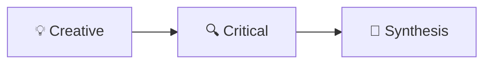
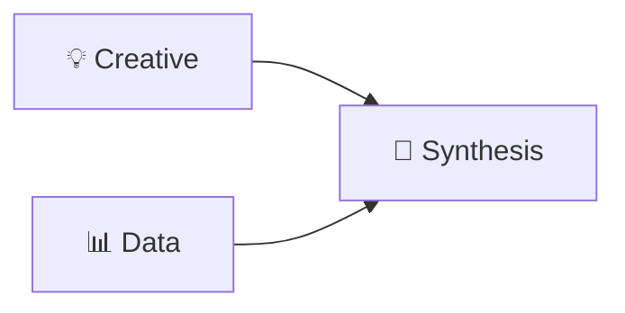
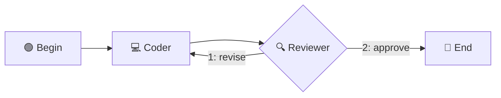

# Create OASIS Workflow YAML

> This document describes the OASIS workflow YAML format (Version 2 — Graph Mode) and how to create workflow schedules for Wecli teams. The format rules are extracted from the visual orchestrator prompt system.

---

## 1. Overview

OASIS workflows define how persona-driven agents collaborate to solve tasks. A workflow is a directed graph where:
- **Nodes** (`plan`) represent persona steps, manual injections, script execution, human interaction, or special control nodes (selectors)
- **Edges** define execution order — a node runs when all its incoming edges are satisfied
- **Conditional edges** enable branching based on runtime conditions
- **Selector edges** enable LLM-powered routing (the selector node chooses which branch to take)

All YAML schedules use **version: 2** with an explicit graph model.

---

## 2. YAML Format Rules (Version 2 — Graph Mode)

### 2.1 Basic Graph Structure

```yaml
version: 2
repeat: false
plan:
  - id: n1                        # Every node MUST have a unique id
    expert: "creative#temp#1"     # Stateless preset persona
  - id: n2
    expert: "critical#temp#1"
  - id: n3
    expert: "#oasis#agent_name"   # Stateful internal session agent (by name, no tag)
  - id: n4
    expert: "creative#oasis#🎨 创意顾问" # Session agent with tag (tag→persona lookup, identifier uses display name)
  - id: m1
    manual:
      author: "主持人"
      content: "Please summarize"

edges:                             # Fixed edges: always fire when source completes
  - [n1, n3]                       # n1 → n3
  - [n2, n3]                       # n2 → n3 (fan-in: n3 waits for BOTH n1 and n2)
  - [n3, n4]                       # n3 → n4
  - [n4, m1]                       # n4 → m1
```

### 2.2 Conditional Branching

```yaml
conditional_edges:
  - source: n3
    condition: "last_post_contains:APPROVED"
    then: n4                       # condition true → go to n4
    else: n2                       # condition false → loop back to n2
```

**Supported conditions:**
- `last_post_contains:<keyword>` — last message contains keyword
- `last_post_not_contains:<keyword>` — last message does not contain keyword
- `post_count_gte:<N>` — message count >= N
- `post_count_lt:<N>` — message count < N
- `always` — always true
- `!<expr>` — negate any expression

### 2.3 Selector Routing (LLM-powered Branching)

A selector node is an expert marked with `selector: true`. The LLM output determines which branch to take.

```yaml
plan:
  - id: router
    expert: "router_tag#temp#1"   # Selector can use any expert format (#temp#, #oasis#, etc.)
    selector: true                 # Mark as selector node

selector_edges:
  - source: router
    choices:
      1: branch_a                  # {"wecli_type": "oasis choose", "choose": 1} → branch_a
      2: branch_b                  # {"wecli_type": "oasis choose", "choose": 2} → branch_b
      3: __end__                   # {"wecli_type": "oasis choose", "choose": 3} → end
```

### 2.4 Parallel Groups (within plan)

```yaml
plan:
  - id: brainstorm
    parallel:
      - expert: "creative#temp#1"
      - expert: "critical#temp#1"
```

### 2.5 All Experts

```yaml
plan:
  - id: discuss
    all_experts: true              # All experts speak simultaneously
```

---

## 3. Graph Rules

| Rule | Description |
|------|-------------|
| **Unique ID** | Every step MUST have a unique `id` field |
| **Edge-driven execution** | Edges define execution order; nodes with all incoming edges satisfied run in parallel automatically |
| **Entry points** | Nodes with no incoming edges are entry points (start immediately) |
| **Termination** | Use `__end__` as a target in edges to terminate the workflow |
| **Cycles** | The graph supports cycles via conditional/selector edges (for loops and debates) |
| **Fan-in** | A node with multiple incoming edges waits for ALL predecessors to complete |
| **Fan-out** | A node with multiple outgoing edges triggers ALL successors |
| **Selector edges** | Selector nodes (`selector: true`) MUST use `selector_edges` for outgoing connections, NOT regular `edges`. Regular edges after a selector will cause incorrect behavior. |

---

## 4. Persona Name Formats (expert field)

> **Note:** The YAML field is named `expert`, but it represents a **persona (人设)** — an **expert persona prompt** that defines an Agent's role and capabilities. It is NOT a separate agent. The `oasis_experts.json` file in each team folder is the persona prompt collection where these prompts are stored.

Persona names follow a `tag#mode#identifier` convention.

> **Important: Tag vs Name**
>
> - **Tag** is a short identifier corresponding to the `tag` field in `oasis_experts.json`. For example: `creative`, `critical`, `architect`. It is used as the **first part** of the `expert` field in YAML to look up the persona prompt.
> - **Name** is the full display name of the persona (e.g., `"🎨 创意顾问"`, `"🔍 批判分析师"`), stored in the `name` field of `oasis_experts.json`. It is used as the **third part** (identifier) in `#oasis#` mode to reference a specific session agent.
> - **In YAML `expert` field**: The format is `tag#mode#identifier`. For `#oasis#` mode, the identifier part uses the **name** (display name), NOT the tag. For example: `creative#oasis#🎨 创意顾问`, NOT `creative#oasis#creative`.
> - For `#temp#` mode, the identifier is just an instance number (e.g., `creative#temp#1`).

| Format | Mode | Description | Example |
|--------|------|-------------|---------|
| `tag#temp#N` | Stateless | Preset persona instance N (no memory) | `creative#temp#1` |
| `tag#oasis#new` | Stateful | Auto-create new session for this persona | `critical#oasis#new` |
| `tag#oasis#name` | Stateful | Internal session agent by name (tag enables persona lookup) | `creative#oasis#🎨 创意顾问` |
| `#oasis#name` | Stateful | Internal session agent by name (no tag) | `#oasis#test1` |
| `tag#ext#id` | External | External ACP agent | `openclaw#ext#Alice` |

### 4.1 Stateless vs Stateful

- **Stateless** (`#temp#`): Lightweight persona, no memory between rounds. Suitable for debates, brainstorming, and one-shot analysis.
- **Stateful** (`#oasis#`): Persona with memory and tools. The session persists across rounds, suitable for complex multi-step tasks.

### 4.2 External ACP Agents

For external ACP agents (tag = `openclaw`, `codex`, `claude`, `gemini`, `aider`, etc.), additional fields are required:

```yaml
- id: ext1
  expert: "openclaw#ext#my_agent"     # Must use short name format: tag#ext#id
  api_url: "http://127.0.0.1:23001"
  api_key: "****"
  model: "agent:my_agent"              # Supports session extension: agent:name or agent:name:session
```

**ACP communication**: External agents with supported tags use the `acpx` CLI adapter (`src/integrations/acpx_adapter.py`) for Agent Client Protocol communication. `acpx` is auto-installed during `setup`. If `acpx` is not available, the system falls back to HTTP-only communication.

**Key configuration requirements:**
- **expert field**: Must use `tag#ext#id` format (tag can be openclaw, codex, etc.)
- **model field**: Supports two formats:
  - `agent:<name>` - uses team name as session by default
  - `agent:<name>:<session>` - explicitly specifies session name

**Session control notes:**
- Same session shares context; different sessions remain independent
- The `<name>` in the model field is only used for routing; the actual agent name comes from the `global_name` field in `external_agents.json`
- Session determines conversation isolation: same session = shared context, different sessions = independent context

---

## 5. Available Step Types

All step types require an `id` field.

| Step Type | Key | Description |
|-----------|-----|-------------|
| Persona | `expert: "name"` | Single persona speaks |
| Parallel | `parallel: [...]` | Multiple personas speak simultaneously |
| All Personas | `all_experts: true` | Everyone speaks at once |
| Manual | `manual: {author, content}` | Inject fixed text (no LLM call) |
| Script | `script: {...}` | Run a platform command via Python-managed subprocess |
| Human | `human: {...}` | Pause workflow and wait for a plain-text human reply |
| Selector | `selector: true` + `expert` | LLM-powered routing node (any expert format) |

### 5.1 Manual Nodes — Special Authors

Manual nodes support special `author` values for workflow control:

| Author | Purpose |
|--------|---------|
| `begin` | Marks the workflow start point |
| `bend` | Marks the workflow end point |
| Custom string | Displays as the speaker name (e.g., `"主持人"`) |

```yaml
- id: start
  manual:
    author: begin
    content: "讨论开始"
- id: end
  manual:
    author: bend
    content: "讨论结束"
```

### 5.2 Script Nodes

Script nodes execute a command and publish the result as a normal forum post, so downstream
conditions, selectors, and summary steps can consume the output directly.

```yaml
- id: run_tests
  script:
    unix_command: "pytest -q"
    windows_command: "python -m pytest -q"
    timeout: 120
    cwd: "."
```

Rules:
- Use `unix_command` / `windows_command` when the command differs by platform
- Or use a shared `command` field when one command works everywhere
- `timeout` is optional; when omitted, the runtime falls back to the workflow timeout defaults
- `cwd` is optional and is constrained to the Wecli project root or current team directory

### 5.3 Human Nodes

Human nodes behave like blocking workflow steps: OASIS posts the prompt, pauses at that node,
and waits for a human to submit a normal text reply.

```yaml
- id: confirm_release
  human:
    prompt: "请确认是否继续发布，并说明原因"
    author: "主持人"
```

Rules:
- Human replies do **not** require JSON
- The workflow canvas only configures the prompt and display author; it does **not** capture the reply itself
- The runtime reply is submitted from the OASIS topic detail UI or from the CLI `topics human-reply` command
- In both Studio and mobile chat, the reply box belongs to the **OASIS topic detail view**, not the workflow editor
- Downstream nodes receive the human reply as a normal forum post

Runtime behavior:
- When execution reaches a `human` node, OASIS creates a normal post for the prompt and marks the topic as waiting for human input
- The topic detail page shows a plain-text input only while that node is pending
- After the human reply is submitted, the `human` node is considered complete and downstream edges continue normally
- If no reply arrives before timeout, OASIS records a timeout post and the workflow proceeds according to its graph

---

## 6. Complete Examples

### 6.1 Simple Sequential Pipeline

Three personas discuss in sequence:

```yaml
version: 2
repeat: false
plan:
  - id: n1
    expert: "creative#temp#1"
  - id: n2
    expert: "critical#temp#1"
  - id: n3
    expert: "synthesis#temp#1"
edges:
  - [n1, n2]
  - [n2, n3]
```



### 6.2 Fan-in Parallel → Merge

Two personas work in parallel, then a synthesizer merges their outputs:

```yaml
version: 2
repeat: false
plan:
  - id: creative
    expert: "creative#temp#1"
  - id: data
    expert: "data#temp#1"
  - id: merge
    expert: "synthesis#temp#1"
edges:
  - [creative, merge]
  - [data, merge]
```



### 6.3 Selector Loop with Exit

A reviewer checks work and decides to loop back or finish:

```yaml
version: 2
repeat: false
plan:
  - id: start
    manual:
      author: begin
      content: "开始代码审查"
  - id: coder
    expert: "coder#temp#1"
  - id: reviewer
    expert: "critical#temp#1"
    selector: true
  - id: done
    manual:
      author: bend
      content: "审查完成"
edges:
  - [start, coder]
  - [coder, reviewer]
selector_edges:
  - source: reviewer
    choices:
      1: coder       # needs revision → loop back
      2: done         # approved → end
```



### 6.4 Script + Human Hybrid Flow

Use a script node to gather machine output, then pause for a human decision:

```yaml
version: 2
discussion: false
repeat: false
plan:
  - id: collect_status
    script:
      unix_command: "git status --short"
      windows_command: "git status --short"
      timeout: 30
  - id: human_gate
    human:
      prompt: "请检查上面的脚本输出，并决定是否继续"
      author: "主持人"
  - id: summarize
    expert: "synthesis#temp#1"
edges:
  - [collect_status, human_gate]
  - [human_gate, summarize]
```

### 6.5 Mixed Pipeline with External Agent

Combines internal personas, an external OpenClaw agent, and a selector:

```yaml
version: 2
repeat: false
plan:
  - id: begin
    manual:
      author: begin
      content: "讨论开始"
  - id: creative
    expert: "creative#temp#1"
  - id: synth
    expert: "synthesis#oasis#综合顾问"
  - id: arch
    expert: "architect#temp#1"
  - id: ext_agent
    expert: "openclaw#ext#my_new_agent"
    api_url: "http://127.0.0.1:23001"
    api_key: "****"
    model: "agent:my_new_agent"
  - id: selector
    expert: "selector#temp#1"
    selector: true
  - id: end
    manual:
      author: bend
      content: "讨论结束"
edges:
  - [begin, creative]
  - [creative, synth]
  - [synth, arch]
  - [arch, ext_agent]
  - [ext_agent, selector]
selector_edges:
  - source: selector
    choices:
      1: ext_agent    # continue discussion
      2: end          # finish
```

### 6.5 Conditional Branching

Route based on content of the last message:

```yaml
version: 2
repeat: false
plan:
  - id: analyzer
    expert: "data#temp#1"
  - id: approve_path
    expert: "synthesis#temp#1"
  - id: reject_path
    expert: "critical#temp#1"
edges:
  - [analyzer, approve_path]       # default edge (may be overridden by conditional)
conditional_edges:
  - source: analyzer
    condition: "last_post_contains:REJECT"
    then: reject_path
    else: approve_path
```

---

## 7. Settings Reference

| Field | Type | Default | Description |
|-------|------|---------|-------------|
| `version` | int | `2` | Must be `2` for graph mode |
| `repeat` | bool | `false` | `true` = repeat plan every round (debates), `false` = execute once (pipelines) |

---

## 8. Workflow File Location

Workflow YAML files are stored at: [[memory:s3bt8876]]

- **Team workflows**: `data/user_files/{user_id}/teams/{team}/oasis/yaml/*.yaml`
- **Public workflows**: `data/user_files/{user_id}/oasis/yaml/*.yaml`

### 8.1 Save via CLI

```bash
# Set a workflow for a team
uv run scripts/cli.py oasis set-workflow \
  --team <TEAM_NAME> \
  --name <WORKFLOW_NAME> \
  --file <PATH_TO_YAML>
```

### 8.2 Save via MCP Tool

The `set_oasis_workflow` MCP tool can be used to save a workflow:
- Provide a descriptive `name` (e.g., `code_review_pipeline`, `brainstorm_trio`)
- Provide the YAML content as string

---

## 9. Execute and Monitor Workflow via CLI

After saving a workflow, you can execute and monitor it using the CLI:

### 9.1 List Workflows

```bash
# List all workflows for a team
uv run scripts/cli.py workflows list --team <TEAM_NAME>
```

### 9.2 Run a Workflow

```bash
# Execute a workflow with a question
uv run scripts/cli.py workflows run \
  --team <TEAM_NAME> \
  --name <WORKFLOW_NAME> \
  --question "your question or task here" \
  --max-rounds <MAX_ROUNDS> \
  [--output <OUTPUT_FILE>]
```

**Parameters:**
- `--question`: The input question or task for the workflow (e.g., "需要开发一个新的系统...")
- `--max-rounds`: Maximum number of discussion rounds (e.g., `--max-rounds 10`)
- `--output`: Optional output file to save the conversation JSON

**Example:**
```bash
uv run scripts/cli.py workflows run \
  --team DevTeam \
  --name product_review_pipeline \
  --question "需要开发一个在线客服系统" \
  --max-rounds 10
```

The command will print the topic ID (e.g., `Topic created: 94a2cbb7`) for tracking.

### 9.3 Monitor Workflow Status

```bash
# View workflow execution details and current status
uv run scripts/cli.py topics show --topic-id <TOPIC_ID>
```

### 9.4 Get Final Conclusion

```bash
# Wait for workflow completion and retrieve final summary
uv run scripts/cli.py workflows conclusion \
  --topic-id <TOPIC_ID> \
  [--output <OUTPUT_FILE>] \
  [--timeout <SECONDS>]
```

**Parameters:**
- `--topic-id`: The topic ID returned when running the workflow
- `--timeout`: Maximum time to wait for completion in seconds (default: 120)

### 9.5 Live Watch

```bash
# Real-time monitoring of workflow progress
uv run scripts/cli.py topics watch --topic-id <TOPIC_ID>
```

---

## 10. Tips & Best Practices

1. **Maximize parallelism**: Nodes with no dependency relationship should run concurrently. Use fan-in/fan-out patterns.
2. **Use selectors for loops**: When you need iterative refinement, use a selector node to decide whether to loop or exit.
3. **Begin/End markers**: Use `manual` nodes with `author: begin` and `author: bend` to clearly mark workflow boundaries.
4. **Stateful for complex tasks**: Use `#oasis#` mode for personas that need memory across rounds (e.g., a coder maintaining context).
5. **Stateless for debates**: Use `#temp#` mode for lightweight discussion personas where memory is not needed.
6. **External agents for specialized work**: Use `#ext#` for delegating to other OpenClaw agents or external APIs with their own tools.
7. **Edge ordering**: Selector node outgoing edges should be defined in `selector_edges`, not in regular `edges`.
8. **Selector edge restriction**: Selector nodes (`selector: true`) must NOT have outgoing edges defined in the regular `edges` section. All outgoing edges from a selector MUST be defined in `selector_edges`. This is a critical rule — violating it will cause the workflow to behave incorrectly.
