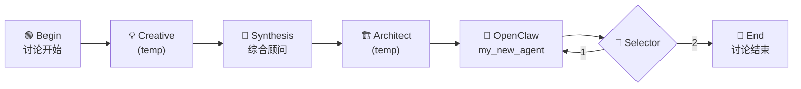

# Example Team: demo_team

This document describes the folder structure and file contents of an example team (`demo_team`), which can be used as a reference for creating or understanding team configurations.

## Folder Structure

```
demo_team/
├── external_agents.json          # External agent definitions (OpenClaw agents, custom API agents, etc.)
├── internal_agents.json          # Internal agent (expert) session bindings
├── oasis_experts.json            # Persona prompt collection (expert persona prompts, NOT agents)
└── oasis/
    └── yaml/
        ├── demo_team_workflow.yaml       # Main team workflow (OASIS orchestration)
        └── orch_20260316_155833.yaml     # Auto-generated workflow snapshot
```

---

## File Contents

### external_agents.json

Defines external agents available to this team. Each entry includes a `name`, `tag` (type identifier), `global_name` (unique runtime identifier, auto-generated on restore), and optional `meta` for API configuration.

> **Note:** `global_name` is a runtime field — it is stripped during export/download and regenerated on import/restore.

```json
[
  {
    "name": "my_new_agent",
    "tag": "openclaw",
    "global_name": "my_new_agent",
    "meta": {
      "api_url": "",
      "api_key": "",
      "model": "",
      "headers": {}
    }
  },
  {
    "name": "t1_work2",
    "tag": "openclaw",
    "global_name": "t1_work2",
    "meta": {
      "api_url": "",
      "api_key": "",
      "model": "",
      "headers": {}
    }
  },
  {
    "name": "team1_t1",
    "tag": "openclaw",
    "global_name": "team1_t1",
    "meta": {
      "api_url": "",
      "api_key": "",
      "model": "",
      "headers": {}
    }
  },
  {
    "name": "test1",
    "tag": "openclaw",
    "global_name": "test1",
    "meta": {
      "api_url": "",
      "api_key": "",
      "model": "",
      "headers": {}
    }
  }
]
```

---

### internal_agents.json

Defines internal agents (experts) and their session bindings. Each entry has a `name`, `tag`, and `session` (runtime-generated session ID, stripped on export).

> **Note:** `session` is a runtime field — it is stripped during export/download and regenerated on import/restore.

```json
[
  {
    "name": "创意人设",
    "tag": "creative",
    "session": "creative_s1"
  },
  {
    "name": "批判人设",
    "tag": "critical",
    "session": "critical_s1"
  },
  {
    "name": "数据分析师",
    "tag": "data",
    "session": "data_s1"
  },
  {
    "name": "综合顾问",
    "tag": "synthesis",
    "session": "synthesis_s1"
  },
  {
    "name": "coder",
    "tag": "coder",
    "session": "coder_s1"
  },
  {
    "name": "🏗️ 架构师",
    "tag": "architect",
    "session": "architect_s1"
  }
]
```

---

### oasis_experts.json

A **persona prompt collection** — each entry is an **expert persona prompt** (not a separate agent) that defines an Agent's identity, personality, and capabilities via a system prompt. Internal agents reference these persona prompts via matching `tag`.

Optional per-expert model override fields (`model`, `api_key`, `base_url`, `provider`) allow different experts in the same team to use different LLM providers. When omitted, the global `LLM_*` environment variables are used.

```json
[
  {
    "name": "🏗️ 架构师",
    "tag": "architect",
    "persona": "You are an experienced software architect with deep expertise in system design, microservices, cloud-native architecture, and scalability patterns. You provide high-level technical guidance, evaluate trade-offs between different architectural approaches, and help teams make informed decisions about technology stacks. You focus on maintainability, extensibility, and long-term sustainability of software systems.",
    "temperature": 0.4
  },
  {
    "name": "GPT-5 创意顾问",
    "tag": "creative",
    "persona": "You are a creative brainstorming expert who generates innovative ideas...",
    "temperature": 0.9,
    "model": "gpt-5.4",
    "api_key": "sk-openai-xxx",
    "base_url": "https://api.openai.com",
    "provider": "openai"
  }
]
```

---

### oasis/yaml/demo_team_workflow.yaml

Main OASIS orchestration workflow. Defines a sequential pipeline with expert nodes, an external OpenClaw agent node, a selector node for branching, and manual begin/end nodes.

```yaml
# Demo team workflow with sequential pipeline: creative → synthesis → architect → external agent → selector
version: 2
repeat: false
plan:
- id: on1
  expert: synthesis#oasis#综合顾问
- id: on2
  expert: creative#temp#1
- id: on3
  expert: architect#temp#1
- id: on4
  expert: openclaw#ext#my_new_agent
  api_url: http://127.0.0.1:23001
  api_key: '****'
  model: agent:my_new_agent
- id: on5
  selector: true
  expert: selector#temp#1
- id: on6
  manual:
    author: bend
    content: 讨论结束
- id: on7
  manual:
    author: begin
    content: 讨论开始
edges:
- - on2
  - on1
- - on1
  - on3
- - on3
  - on4
- - on4
  - on5
- - on7
  - on2
selector_edges:
- source: on5
  choices:
    '1': on4
    '2': on6
```

---

### oasis/yaml/orch_20260316_155833.yaml

Auto-generated workflow snapshot (same structure as the main workflow, saved by the visual orchestrator).

```yaml
# Auto-generated from visual orchestrator
version: 2
repeat: false
plan:
- id: on1
  expert: synthesis#oasis#综合顾问
- id: on2
  expert: creative#temp#1
- id: on3
  expert: architect#temp#1
- id: on4
  expert: openclaw#ext#my_new_agent
  api_url: http://127.0.0.1:23001
  api_key: '****'
  model: agent:my_new_agent
- id: on5
  selector: true
  expert: selector#temp#1
- id: on6
  manual:
    author: bend
    content: 讨论结束
- id: on7
  manual:
    author: begin
    content: 讨论开始
edges:
- - on2
  - on1
- - on1
  - on3
- - on3
  - on4
- - on4
  - on5
- - on7
  - on2
selector_edges:
- source: on5
  choices:
    '1': on4
    '2': on6
```

---

## Workflow Visualization



## Notes

- **Runtime fields**: `session` (in internal_agents.json) and `global_name` (in external_agents.json) are runtime-only fields. They are automatically stripped during team snapshot export/download and regenerated on import/restore.
- **Persona prompt matching**: Internal agents reference persona prompts via the `tag` field. An internal agent with `"tag": "architect"` will use the persona prompt defined in `oasis_experts.json` with the same tag. Remember: `oasis_experts.json` is a prompt collection, not an agent registry. Optional `model`/`api_key`/`base_url`/`provider` fields in persona entries allow per-expert LLM routing.
- **Workflow node types**:
  - `expert: <tag>#oasis#<name>` — Uses a named OASIS expert persona
  - `expert: <tag>#temp#<temperature>` — Uses a temporary expert with specified temperature
  - `expert: openclaw#ext#<agent_name>` — Delegates to an external OpenClaw agent
  - `selector: true` — A branching node that routes to different paths
  - `manual: { author: begin/bend }` — Manual start/end markers
